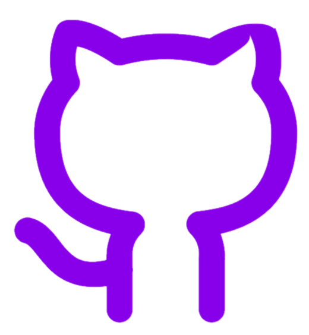

## Welcome to my page!


## Contact Me:

 Fort Collins, CO

[](https://github.com/A-Lyon/Public_Code) [](https://www.linkedin.com/in/andrew-lyon-1343a621b/) [](mailto:simba3003@gmail.com)

## About Me:

> I am graduating with a Bachelors of Science in Computer Science in May 2022. I have focused my course work on software engineering, human computer interfacing, and data structures. I am currently a data structures teachers assistant, and I work in the natural user interfaces (NUI) lab at Colorado State University (CSU). 
>
> I earned a Bachelors of Science in Biological Sciences from CSU in 2014. As a biologist I managed the bacterial fruit blotch department of a plant pathology laboratory (Eurofins Biodiagnostics) for 6 years. I returned to CSU for computer science as I witnessed the biology field progressing into computational models and machines.
>
> Prior to my college accomplishments, I served as an airborne ranger in the Army as part of the Special Operations Command (SOCOM) unit of the 1st Ranger Battalion, 75th Ranger Regiment. I deployed to Afghanistan and Iraq.

## Education:

> 2021-2023:
> [B.S. Computer Science](https://compsci.colostate.edu/) 
>
> 2011-2014
> [B.S. Biological Science](https://www.biology.colostate.edu/)
>
> 2001-2005
> [Millard West High School](https://mwhs.mpsomaha.org/)

## Projects/Code:

> Here is a selection of code that I have produced. These may be full files, or portions of projects that I have worked on as part of a team.

### [Data Structures](https://github.com/A-Lyon/Public_Code/tree/main/DataStructures)
This collection of data structures were produced by me for a data structures class at CSU. I was hired to teach to students in lab sections for this class after . These files have my implementations of the data structures to accomplish the goals set by the class, many include test files.

### [NUI Lab](https://github.com/A-Lyon/Public_Code/tree/main/NUIProjects)
These partial files were produced by me on team projects for the NUI lab. This code is protected by Colorado State Universities 

### [Coursework](https://github.com/A-Lyon/Public_Code/tree/main/Courses)


|+:------------------------------------------------------------:+|

Text can be **bold**, _italic_, or ~~strikethrough~~.

[Link to another page](./another-page.html).

There should be whitespace between paragraphs.

There should be whitespace between paragraphs. We recommend including a README, or a file with information about your project.

# Header 1

This is a normal paragraph following a header. GitHub is a code hosting platform for version control and collaboration. It lets you and others work together on projects from anywhere.

## Header 2

> This is a blockquote following a header.
>
> When something is important enough, you do it even if the odds are not in your favor.

### Header 3

```js
// Javascript code with syntax highlighting.
var fun = function lang(l) {
  dateformat.i18n = require('./lang/' + l)
  return true;
}
```

```ruby
# Ruby code with syntax highlighting
GitHubPages::Dependencies.gems.each do |gem, version|
  s.add_dependency(gem, "= #{version}")
end
```

#### Header 4

*   This is an unordered list following a header.
*   This is an unordered list following a header.
*   This is an unordered list following a header.

##### Header 5

1.  This is an ordered list following a header.
2.  This is an ordered list following a header.
3.  This is an ordered list following a header.

###### Header 6

| head1        | head two          | three |
|:-------------|:------------------|:------|
| ok           | good swedish fish | nice  |
| out of stock | good and plenty   | nice  |
| ok           | good `oreos`      | hmm   |
| ok           | good `zoute` drop | yumm  |

### There's a horizontal rule below this.

* * *

### Here is an unordered list:

*   Item foo
*   Item bar
*   Item baz
*   Item zip

### And an ordered list:

1.  Item one
1.  Item two
1.  Item three
1.  Item four

### And a nested list:

- level 1 item
  - level 2 item
  - level 2 item
    - level 3 item
    - level 3 item
- level 1 item
  - level 2 item
  - level 2 item
  - level 2 item
- level 1 item
  - level 2 item
  - level 2 item
- level 1 item

### Small image


### Large image


### Definition lists can be used with HTML syntax.

<dl>
<dt>Name</dt>
<dd>Godzilla</dd>
<dt>Born</dt>
<dd>1952</dd>
<dt>Birthplace</dt>
<dd>Japan</dd>
<dt>Color</dt>
<dd>Green</dd>
</dl>


> [](https://github.com/A-Lyon/Public_Code).

[](https://github.com/A-Lyon/Public_Code)

[](https://www.linkedin.com/in/andrew-lyon-1343a621b/)

[](mailto:simba3003@gmail.com)


```
Long, single-line code blocks should not wrap. They should horizontally scroll if they are too long. This line should be long enough to demonstrate this.
```

```
The final element.
```
