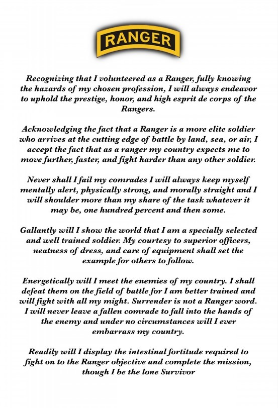

## Welcome to my page!

## Contact Me:

 Fort Collins, CO

  

## About Me:

> I am graduating with a Bachelors of Science in Computer Science in May 2023. I have focused my course work on software engineering, human computer interaction, and data structures. I am currently a data structures teachers assistant, and I work in the natural user interfaces (NUI) lab at Colorado State University (CSU). Several courses that I have completed at CSU required extensive group work. We used tools like the SCRUM method in conjunction with GitHub and ZenHub to plan, produce, and demonstrate usable software to mock-clients (our professors).
>
> I earned a Bachelors of Science in Biological Sciences from CSU in 2014. As a biologist I managed the bacterial fruit blotch department of a plant pathology laboratory (Eurofins Biodiagnostics) for 6 years. In this role I saw the beneficial impact of technology on biological research, and decided to return to school to learn computer science.
>
> Prior to my college accomplishments, I served in 1st Ranger Battalion of the 75th Ranger Regiment as an Airborne Ranger. As part of Special Operations Command (SOCOM) I deployed to Afghanistan and Iraq. My military experience provided me with core values of a stalwart work ethic, galiant leadership, and humble professionalism. I do my best to apply these values to every aspect of my life.

## Education:

> 2021-2023:
> [B.S. Computer Science](https://compsci.colostate.edu/) 
>
> 2011-2014
> [B.S. Biological Science](https://www.biology.colostate.edu/)
>
> 2001-2005
> [Millard West High School](https://mwhs.mpsomaha.org/)

## Skills

> Through my education at CSU I have gained experience in several coding methodologies, teamwork exercises, and project completion. 
> - Object Oriented Programming
> - GitHub Integration
>   - GitHub Pages
>   - GitHub Projects
>   - ZenHub
> - SCRUM Method
>   - Scrum Leader
>   - Scrum Recorder
> - REST API
> - Game Engine
>   - Unity
>      - Unity web requests
>   - Unreal Engine
>      - Visual Scripting
>      - Blueprints
> - Algorithms
>   - Complexity
>   - Memoization
> - 3D modeling
>   - Blender
> - Languages
>   - Java
>   - C#
>   - C
>   - C++
>   - Python
>   - Linux
>   - JavaScript
>      - Node

## Projects/Code:

> Here is a selection of code that I have produced. These may be full files, or portions of projects that I have worked on as part of a team. Click on the headers to be taken to my public github repository with collections of code that I have written. Any code that was part of a larger project will only contain files that I have written personally.
>
> ### [Data Structures](https://github.com/A-Lyon/Public_Code/tree/main/DataStructures)
> This collection of data structures were produced by me for a data structures class at CSU. I was hired to teach to students in lab sections for this class after . These files have my implementations of the data structures to accomplish the goals set by the class, many include test files.
>
> ### [NUI Lab](https://github.com/A-Lyon/Public_Code/tree/main/NUIProjects)
> These partial files were produced by me on team projects for the NUI lab. This code is protected by Colorado State Universities [Copyright](https://marcomm.colostate.edu/copyright-guidelines/). Any use of this code without my consent will violate this copyright.
>
> ### [Coursework](https://github.com/A-Lyon/Public_Code/tree/main/Courses)
> This collection of code contains excerpts from CS classes that I have taken. The coding languages and assignents vary greatly.

## Thank you for visiting. Have a great day! 

